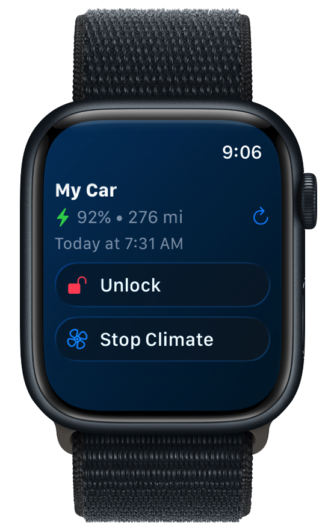

# BetterBlue

<p align="center">
  
  
</p>

<p align="left">
<a href="https://testflight.apple.com/join/n7NRXTWb">

</a>
</p>

<p align="left">
<a href="https://markschmidt.io/betterblue">

</a>
</p>

A modern iOS app for controlling your Hyundai or Kia vehicle using BlueLink and Kia Connect services. Built with SwiftUI and powered by [BetterBlueKit](https://github.com/schmidtwmark/BetterBlueKit/tree/main).

## Features

### 🚗 Vehicle Control
- **Lock/Unlock** your vehicle remotely
- **Climate Control** with custom temperature, defrost, and seat heating
- **Charging Control** for electric and plug-in hybrid vehicles
- **Real-time Status** monitoring

### 🔋 Multi-Powertrain Support
- **Electric Vehicles** (BEV) - battery level, range, charging status
- **Gas Vehicles** - fuel level and range
- **Plug-in Hybrids** (PHEV) - both electric and gas systems

### 📱 iOS Features
- **Widget Support** - quick vehicle status on your home screen
- **Apple Watch App** - control your vehicle from your wrist
- **Shortcuts** - Automate vehicle actions and use Siri to send commands
- **Dark Mode** - full support for light and dark themes
- **Multiple Accounts** - manage vehicles from different accounts

### 🛠 Developer Features
- **HTTP Logging** - detailed request/response debugging
- **SwiftData** - modern data persistence
- **SwiftUI** - native iOS user interface
- **Async/Await** - modern Swift concurrency
- **Fake Vehicle Mode** - test the app without a real vehicle

## Project Structure

```
BetterBlue/
├── BetterBlue/                 # Main iOS app
│   ├── Views/                  # SwiftUI views
│   ├── Models/                 # SwiftData models
│   ├── Utility/               # Helper classes
│   └── BetterBlueApp.swift    # App entry point
├── BetterBlueWatch/           # Apple Watch app
├── Widget/                    # iOS widgets
├── BetterBlueKit/             # Swift package for API
└── README.md                  # This file
```

## Architecture

- **BetterBlueKit**: Swift package handling all API communication
- **SwiftData**: Modern Core Data replacement for persistence
- **SwiftUI**: Declarative UI framework
- **Combine/Async**: Reactive programming and concurrency
- **CloudKit**: iCloud sync for settings and accounts

## Development

### Linting
The project uses SwiftLint for code style enforcement:
```bash
swiftlint lint
```

### Debugging
- HTTP requests are logged in the app under Settings > HTTP Logs
- Vehicle status can be monitored in real-time
- Fake vehicles support custom scenarios for testing

## Privacy & Security

- **Credentials**: Stored securely in iCloud with SwiftData
- **Network**: All API calls use HTTPS encryption

## Important Notes

- **Subscription Required**: You need an active BlueLink/Kia Connect subscription
- **Battery Impact**: Frequent remote commands may drain your vehicle's 12V battery
- **Rate Limits**: Respect API rate limits to avoid account suspension
- **Unofficial**: This app is not affiliated with Hyundai or Kia
- **Terms of Service**: Ensure you comply with your vehicle service terms

## License

This project is licensed under the MIT License - see the [LICENSE](LICENSE) file for details.
